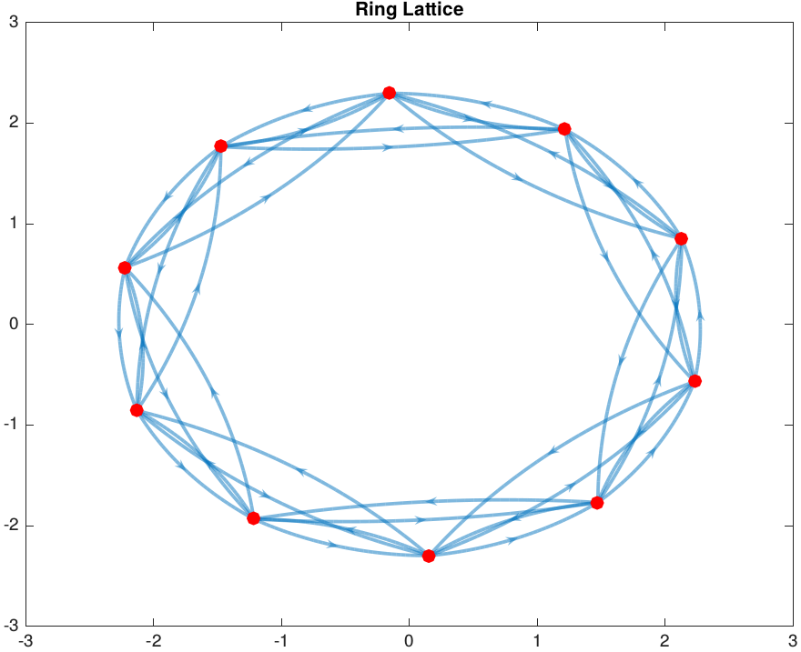
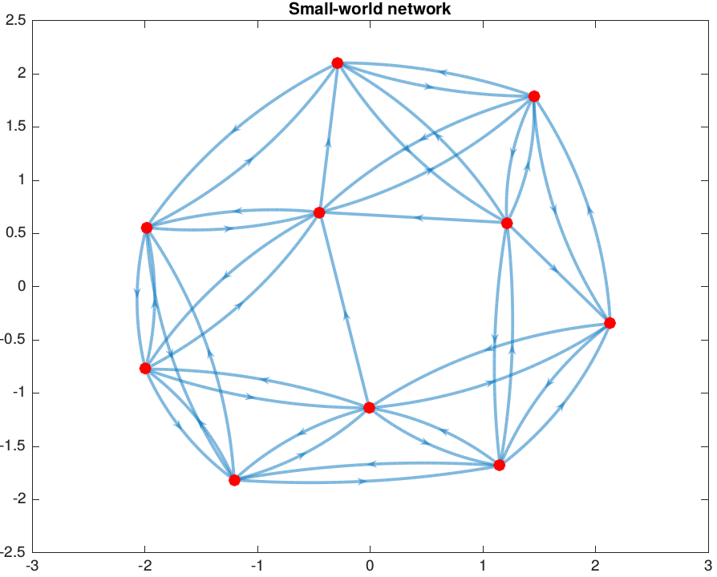
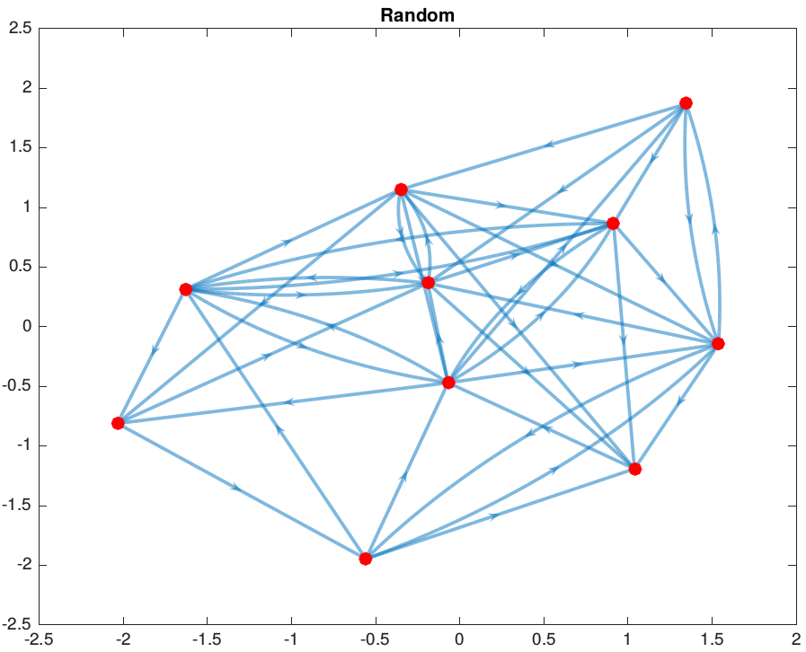

# SWoNs

OVERVIEW
========
This repository contains code for the project "Synchronizing to Decide
in Small-World Networks" from the 2018 Summer School in Computational Sensory-Motor Neuroscience ([CoSMo 2018](http://www.compneurosci.com/CoSMo/)).

This code allows you to generate and test network connectivity structures applied to decision making tasks. Networks are generated using Rudolph-Lilith and Muller's method for small-world directed graphs [1], along with implementation details from Watts and Strogatz's 1998 paper on small-world networks [2]. By varying Rudolph-Lilith and Muller's rewiring proportion, *q* - analgous to Watts and Strogatz's rewiring probability *p*, networks can be produced along the continuum of ring lattice --> small world network --> random network.

FILE STRUCTURE
==============
The structure of the files is as follows:

**Initalization Files**
- createNetwork.m
	- networkStats.m
		- characteristicPathLength.m
		- clusteringCoefficient.m
	- generateRandomNetwork.m
- createEnvironment.m

**Oscillator Files**
- To be completed.

**Simulation Scripts**
- To be completed.

REFERENCES
==========
[1] Michelle Rudolph-Lilith and Lyle E. Muller. Algebraic approach to small-world
network models. Physical Review E - Statistical, Nonlinear, and Soft Matter Physics,
89(1):1–8, 2014.
[2] Duncan J. Watts and Steven H. Strogatz. Collective dynamics of ’small-world’ net-
works. Nature, 393(6684):440–442, 1998.
___
NOTE: This code has been tested on MATLAB 2018a.
