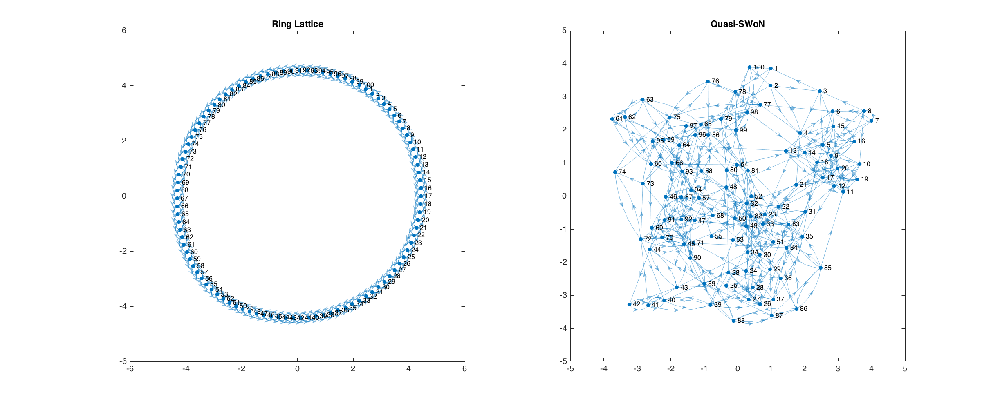

# SWoNs

Code for generating and testing network connectivity structures for decision making tasks. Networks can be generated along the continuum of ring lattice - small world - random.

The structure of the files is as follows (more in depth documentation to follow):

createNetwork.m --------|
			|
			|______kuramSim.m______ <output analysis to be coded>
			|
			|
createEnvironment.m-----|
